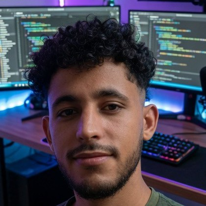
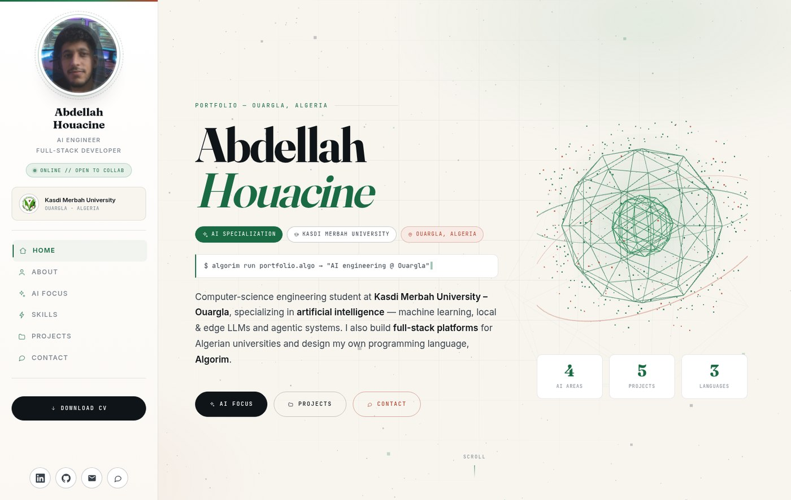
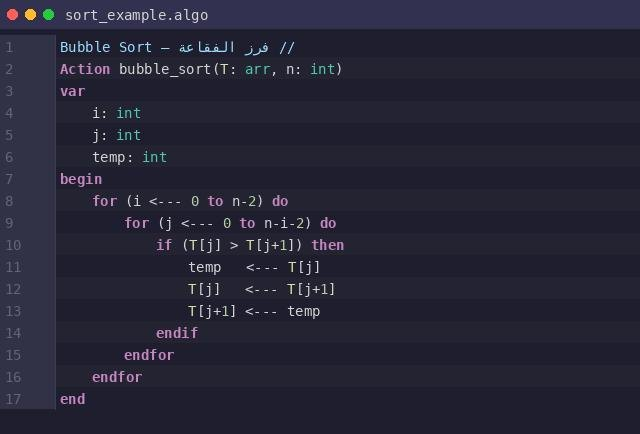
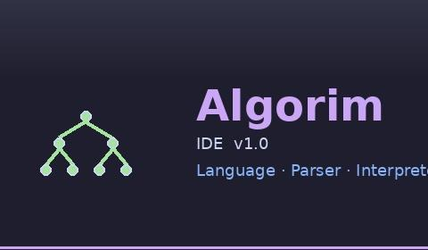
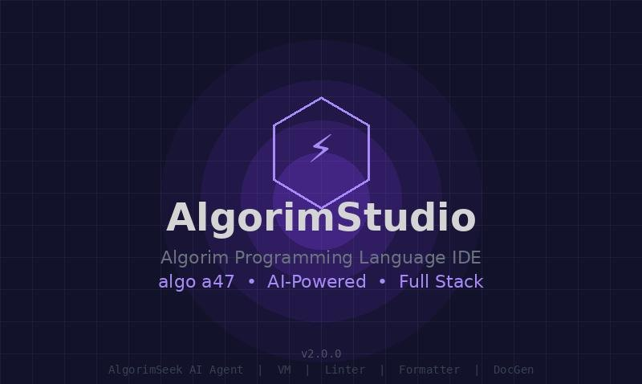
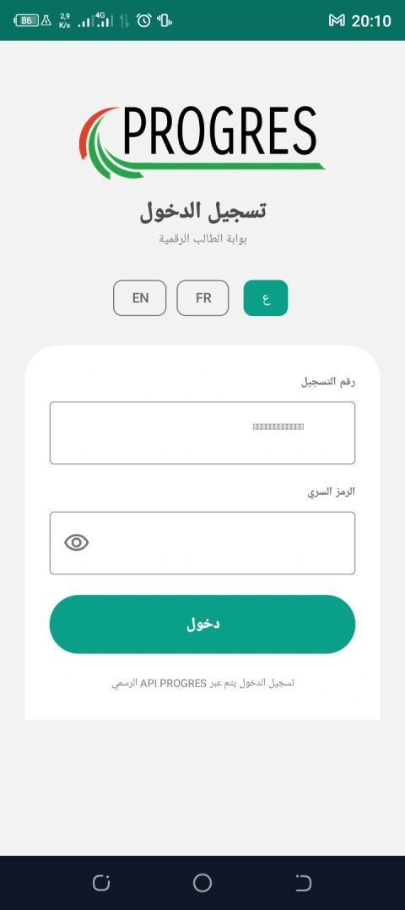
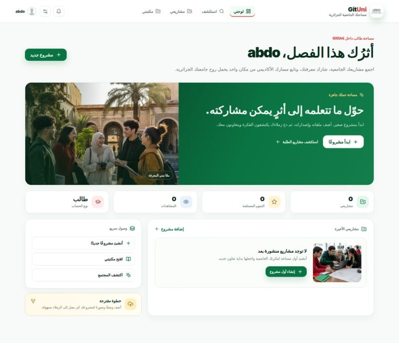
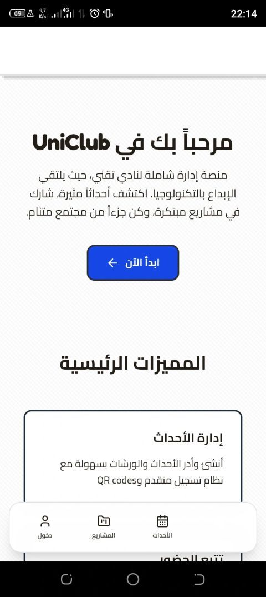
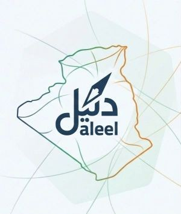

<!-- ══════════════════════════════════════════════════════════════════════════════
     ABDELLAH HOUACINE — GitHub Profile
     AI Engineering Student · Kasdi Merbah University, Ouargla 🇩🇿
     Portfolio → https://houacine-abdellah.github.io/houacine-abdellah/
     ══════════════════════════════════════════════════════════════════════════════ -->

<div align="center">


<br/><br/>


<h1>Abdellah Houacine</h1>

<h3>AI Engineering Student &nbsp;·&nbsp; Full-Stack Developer &nbsp;·&nbsp; Language Designer</h3>

<p>
  
  <b>Kasdi Merbah University — Ouargla, Algeria</b> 🇩🇿
</p>

<a href="https://houacine-abdellah.github.io/houacine-abdellah/">
  
</a>

<a href="https://houacine-abdellah.github.io/houacine-abdellah/">
  
</a>
<br/>

<a href="https://houacine-abdellah.github.io/houacine-abdellah/"></a>
<a href="https://www.linkedin.com/in/abdellah-houacine-151882393/"></a>
<a href="mailto:Houacine.Abdellah.ai@gmail.com"></a>

<br/><br/>


</div>

---

## 🧠 `$ whoami`

```console
$ whoami
abdellah // ai engineering student · full-stack developer · language builder

$ cat ./education
Kasdi Merbah University — Ouargla, Algeria
Computer Science Engineering · Specialty: Artificial Intelligence

$ ls ./now
algorim/  progres/  gituni/  uniclub/  daleel/

$ ./status.sh --live
ONLINE // Deep-learning at Kasdi Merbah, Ouargla… ▌
```

I am an **AI engineering student from Ouargla, Algeria**, specializing in **artificial intelligence** — machine learning, **local & edge LLMs**, and **agentic systems**. My work sits where applied AI meets real products: models that run close to the user instead of inside someone else's data centre, agents that automate real tasks, and full-stack platforms for Algerian universities.

I also design **Algorim**, my own programming language — lexer, parser, interpreter, VM and an AI-powered IDE.

<div dir="rtl" align="right">

<p>
<b>مرحباً 👋 أنا عبد الله حواسين</b> — طالب هندسة ذكاء اصطناعي في <b>جامعة قاصدي مرباح، ورقلة</b> 🇩🇿
</p>
<p>
تخصصي هو <b>هندسة الذكاء الاصطناعي</b>: تعلم الآلة، النماذج اللغوية المحلية التي تعمل دون اتصال، والأنظمة الوكيلية. أعمل أيضاً على تطوير <b>لغة برمجة جديدة (Algorim)</b> ومنصات رقمية للجامعات الجزائرية.
</p>

</div>

---

## 🎯 AI Specialization

<table>
<tr>
<td width="50%" valign="top">
<h4>🧩 Edge &amp; Offline AI</h4>
<p><b>ذكاء اصطناعي محلي دون اتصال</b></p>
<p>Quantized models served straight from the machine in front of me — private, fast, and fully usable with no connection at all.</p>
<p><code>Ollama</code> <code>llama.cpp</code> <code>GGUF</code> <code>Quantization</code></p>
</td>
<td width="50%" valign="top">
<h4>🕸️ Agentic Systems</h4>
<p><b>أنظمة الوكلاء الذكية</b></p>
<p>Agents that plan, call tools and chain steps to finish a real task — with retrieval over my own documents and vector stores.</p>
<p><code>Tool use</code> <code>RAG</code> <code>ChromaDB</code> <code>Pipelines</code></p>
</td>
</tr>
<tr>
<td width="50%" valign="top">
<h4>🎯 Training &amp; Fine-Tuning</h4>
<p><b>التدريب والضبط الدقيق</b></p>
<p>Building datasets and adapting open models so they answer in the language, tone and domain a project actually needs.</p>
<p><code>PyTorch</code> <code>Datasets</code> <code>Fine-tuning</code> <code>Evaluation</code></p>
</td>
<td width="50%" valign="top">
<h4>✨ Applied AI Products</h4>
<p><b>الذكاء الاصطناعي في منتجات حقيقية</b></p>
<p>Shipping intelligence inside products students really use: speech, vision and assistants that work in Arabic, French and English.</p>
<p><code>Whisper</code> <code>XTTS-v2</code> <code>Vision</code> <code>NLP</code></p>
</td>
</tr>
</table>

---

## 🚀 Featured Projects

### 🔤 Algorim — a new programming language

<p><b>لغة برمجة جديدة</b> &nbsp;·&nbsp; <code>IN PROGRESS</code></p>

<p align="center">
  <a href="https://houacine-abdellah.github.io/houacine-abdellah/#projects"></a>
  <a href="https://houacine-abdellah.github.io/houacine-abdellah/#projects"></a>
  <a href="https://houacine-abdellah.github.io/houacine-abdellah/#projects"></a>
</p>

A programming language I am building from scratch, with a readable pseudocode-style syntax (`Action`, `var`, `begin … end`, `←` assignment) that even supports **Arabic comments**.

- **Algorim IDE v1.0** — the language itself: lexer, parser, interpreter and VM
- **AlgorimStudio v2.0** — an AI-powered full-stack IDE with the **AlgorimSeek** agent, linter, formatter and DocGen

<p><code>Language design</code> <code>Lexer</code> <code>Parser</code> <code>Interpreter</code> <code>VM</code> <code>Linter</code> <code>Formatter</code> <code>DocGen</code> <code>AI Agent</code></p>

<table>
<tr>
<td width="50%" valign="top">
<h3>📱 PROGRES</h3>
<p><b>بوابة الطالب الرقمية</b> &nbsp;·&nbsp; <code>NEW VERSION</code></p>
<a href="./assets/projects/progres.jpg"></a>
<p>The new version of the digital student portal for Algerian universities — a full-stack mobile app with Arabic, French and English interfaces and sign-in through the official PROGRES API.</p>
<p><code>Full-stack</code> <code>Mobile</code> <code>AR · FR · EN</code> <code>REST API</code></p>
</td>
<td width="50%" valign="top">
<h3>🎓 GitUni</h3>
<p><b>مساحتك الجامعية الجزائرية</b> &nbsp;·&nbsp; <code>IN PROGRESS</code></p>
<a href="./assets/projects/gituni.jpg"></a>
<p>A shared workspace for Algerian students, teachers and researchers: publish university projects, share knowledge, keep a personal library and discover what the community is building.</p>
<p><code>Projects</code> <code>Library</code> <code>Discover</code> <code>Profiles</code> <code>RTL UI</code></p>
</td>
</tr>
<tr>
<td width="50%" valign="top">
<h3>🎪 UniClub</h3>
<p><b>منصة إدارة شاملة لنادي تقني</b> &nbsp;·&nbsp; <code>IN PROGRESS</code></p>
<a href="./assets/projects/uniclub.jpg"></a>
<p>A complete management platform for a tech club: create and run events and workshops with an advanced registration system and QR codes, track attendance, and showcase member projects.</p>
<p><code>Events</code> <code>QR codes</code> <code>Attendance</code> <code>Projects</code></p>
</td>
<td width="50%" valign="top">
<h3>🧭 Daleel</h3>
<p><b>دليل</b> &nbsp;·&nbsp; <code>IN PROGRESS</code></p>
<a href="./assets/projects/daleel.jpg"></a>
<p>An Algeria-focused guide project — <i>daleel</i> means “guide” in Arabic — with its own brand identity built around the map of the country.</p>
<p><code>Branding</code> <code>Algeria</code> <code>AR · EN</code></p>
</td>
</tr>
</table>

<details>
<summary><b>🧰 Earlier work — click to expand</b></summary>
<br/>

| Project | What it is |
| :--- | :--- |
| **QNEXUS** | Quantum circuit emulator and simulator |
| **DeepAgentX** | Framework for building autonomous AI agents |
| **NeuroTrain Studio** | LLM fine-tuning and dataset preparation studio |
| **MR.Engine** | 3D studio / real-time rendering experiments |
| **Digital Persona** | Conversational AI persona experiments |
| **WiFi Human Sensing** | Sensing human presence through WiFi signal analysis |

</details>

---

## 🌐 Live Portfolio

<div align="center">

<a href="https://houacine-abdellah.github.io/houacine-abdellah/">
  
</a>

<p>
<b>Design &amp; code by me</b> — editorial typography, GSAP motion and a Three.js 3D AI core.<br/>
Deployed automatically with <b>GitHub Actions</b> on every push.
</p>

<a href="https://houacine-abdellah.github.io/houacine-abdellah/#projects"></a>

</div>

---

## 🛠️ Tech Stack

**AI &amp; Machine Learning**


**Web &amp; Backend**


**Mobile &amp; 3D**


**Data, Infra &amp; Tools**


---

## 📊 GitHub Stats

<div align="center">


<br/>


</div>

---

## 🐍 Contribution Graph

<div align="center">

<picture>
  <source media="(prefers-color-scheme: dark)" srcset="https://raw.githubusercontent.com/houacine-abdellah/houacine-abdellah/output/github-contribution-grid-snake-dark.svg" />
  <source media="(prefers-color-scheme: light)" srcset="https://raw.githubusercontent.com/houacine-abdellah/houacine-abdellah/output/github-contribution-grid-snake.svg" />
  
</picture>

</div>

---

## 🗺️ Learning Journey

| Phase | Milestone | What happened |
| :---: | :--- | :--- |
| `01` | **Foundations** | Python, algorithms and the mathematics behind machine learning — learned by rebuilding the basics, not just importing them |
| `02` | **Building for real users** | Full-stack and mobile products for Algerian universities — student portals, club platforms, community workspaces (AR · FR · EN) |
| `03` | **Local intelligence** | Moved from cloud APIs to models running on my own hardware: Ollama, llama.cpp and quantized GGUF weights — for privacy, speed and independence |
| `04` | **AI engineering @ Ouargla** | Deep learning, agentic architectures and fine-tuning — while designing **Algorim**, my own programming language, and its AI-powered IDE |

---

## 🎓 Education

<table>
<tr>
<td width="70" valign="middle" align="center">

</td>
<td valign="middle">
<h4>Kasdi Merbah University — Ouargla, Algeria 🇩🇿</h4>
<p><b>Computer Science Engineering</b> &nbsp;·&nbsp; Specialty: <b>Artificial Intelligence</b></p>
</td>
</tr>
</table>

**Languages I speak:** Arabic (native) · French · English

---

## 📬 Let's connect

I am open to collaboration on **AI projects, research and student platforms** — and to internship opportunities in machine learning and AI engineering.

<div align="center">

<a href="https://houacine-abdellah.github.io/"></a>
<a href="https://www.linkedin.com/in/abdellah-houacine-151882393/"></a>
<a href="https://github.com/houacine-abdellah"></a>
<a href="mailto:Houacine.Abdellah.ai@gmail.com"></a>

<br/><br/>

<i>“Build it from the ground up — then make it useful to someone.”</i>

</div>

---

<!-- REPOS:START -->
<!-- This section is refreshed automatically by .github/workflows/update-projects.yml -->

### 🆕 Recently updated repositories

_Loading… run the **Update latest projects** workflow once to populate this list._

<!-- REPOS:END -->

<div align="center">
<br/>


</div>
